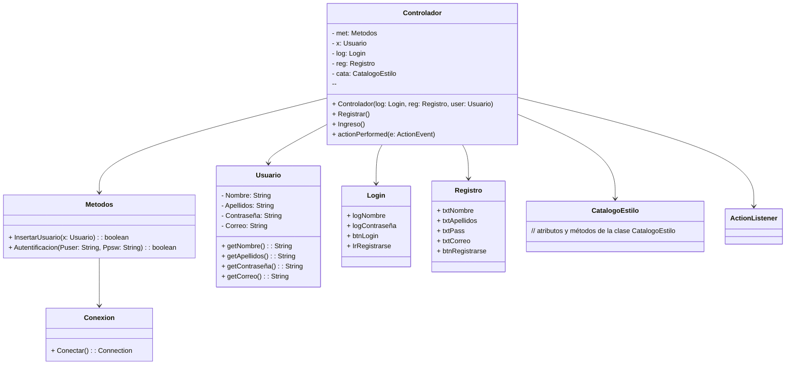
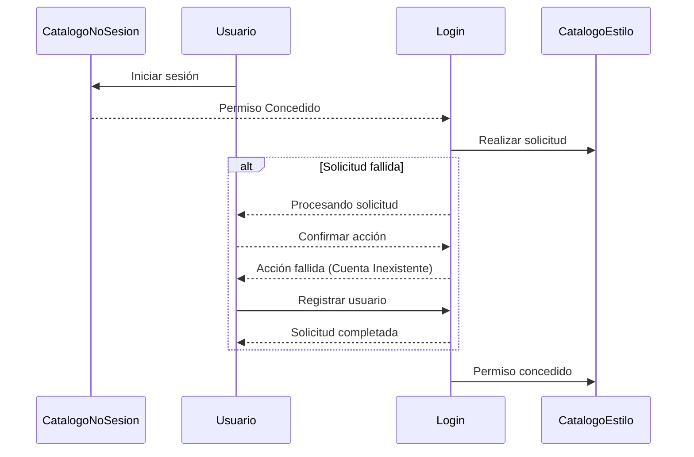

# ProyectoTiendaV2

## Proyecto COD + PROG 3a EV

La idea del proyecto es crear una aplicación de una tienda en la cual los usuarios podrán navegar entre los diferentes productos disponibles para su futura compra. La aplicación en un principio dispondrá de las siguientes opciones:

### Usuarios:

  - Opción de navegar por la aplicación **sin cuenta** y por ende sin la posibilidad de comprar productos.
  - Posibilidad de **crear** una cuenta propia.
  - Posibilidad de **iniciar sesión** una vez creada su cuenta para poder **comprar** los diferentes productos del catálogo.
  - Poder seleccionar entre diferentes **métodos de pago** a la hora de comprar un producto.

### Administradores:

  - Posibilidad de **crear**, **editar** o **eliminar** productos del catálogo.
  - Capacidad de **eliminar** o **crear** nuevos usuarios.

### Extras:

  - **Cifrado hash** de la base de datos.
  - **Interfaz gráfica** para que el usuario pueda navegar de forma amigable por el entorno de la página web.
  - **Saludo** personalizado al usuario dependiendo de su nombre de usuario.
  - Posibilidad de **imprimir** un **ticket de compra** una vez realizado un pedido.
  - Posibilidad de desplegar el proyecto en **Web**.

### Diagrama de clases:

### Diagrama de secuencia:

Muchas gracias por el tiempo que has empleado leyendo esta breve introducción a nuestro proyecto, si deseas ver más informacióna acerca de lo que fue el desarrollo de todo el proyecto puedes acceder a ella desde nuestra página de [Wiki](https://github.com/PachecoASIR/ProyectoTiendaV2/wiki).

### Participantes en el desarrollo del proyecto:

Autor: @PachecoASIR

Colaboradores: @FranciscoFerreiraT
